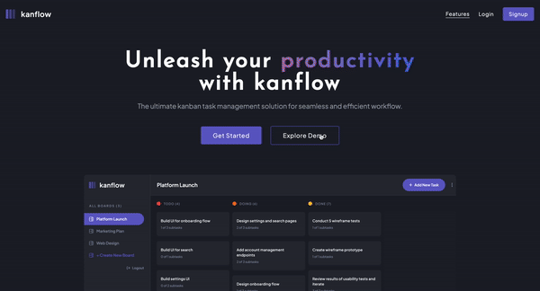

# kanflow
> Kanflow is the ultimate kanban task management solution, embracing simplicity and minimalism, providing users with a clean and easy-to-navigate workspace. Users can create, update, and delete boards and tasks, and break complex tasks into manageable subtasks. Features intuitive drag-and-drop functionality to change task's status and re-order them in a column.

## Demo
[Live Demo](https://kanflow.cyclic.app/)

## Built with
- React, Vite
- Express.js, Node.js
- Mongoose.js, MongoDB
- Passport.js
- TailwindCSS
- HTML5/CSS3
- Hosted on Cyclic

## Features
#### Home Page:
- Call to action buttons for signing up and logging into an account
- Explore Demo button to allow users to test out the application as a demo user
- Features section highlighting the app's key functionalities

#### Auth Page:
- User authentication supported with Passport.js LocalStrategy with email and password encryption using Bcrypt password-hashing
- Custom form validation for login and sign up pages

#### Board Page:
- Create, read, update, and delete boards and tasks
- Receive form validations when trying to create/edit boards and tasks
- Mark subtasks as complete and move tasks between columns
- Hide/show the board sidebar
- Toggle the theme between light/dark modes
- Allow users to drag and drop tasks to change their status and re-order them in a column

## Optimizations
#### Cookies and Monorepo
Initially, the client-side was hosted on Render and the server-side was hosted on Cyclic. However, I began to encounter authentication issues with Chrome and Safari. Despite successfully authentication, I would receive a 401 Unauthorized status code upon redirection in the application because my cookies were not getting stored correctly. After researching and consulting both StackOverflow and the Express documentation, I implemented `app.set('trust proxy', 1)`, allowing the correct navigation to the `/board` path for logged-in users. While this resolves the issue for most browsers, Safari continued to pose more challenges due to its strict third-party cookie policies. To solve this, I opted to consolidate both the client and server components into a single repository hosted on Cyclic. This helped address the issues related to CORS limitations and Safari's third-party cookie policies. By serving the client-side code through the server, both components share the same origin, eliminating any cross-origin issues and allowing for seamless routing.

## Running this Project Locally
#### Server
In one terminal:
1. Create `.env` variables `PORT` and `DB_STRING`
2. Run `npm install` to install all relevant packages and dependencies
3. Run `NODE_ENV=development node server.js` to start a dev server and view the project in your browser

#### Client
In a second terminal:
1. `cd` to the `client` directory
2. Run `npm install` to install all relevant dependencies
3. Run `npm run dev` to start a dev server and view the project in your browser

## Future Enhancements
- [ ] Due dates and reminders
  - Users can set due dates for tasks and receive timely reminders, ensuring to stay on top of deadlines
- [ ] Priority Levels
  - Prioritize tasks with customizable priority levels, to focus on what matters most
- [ ] Search and Filters
  - Easily find and filter tasks based on keywords, tags, or other criteria, streamlining the search process
- [ ] Integration with Calendar
  - Sync tasks and due dates with the user's calendar for a consolidated view of your schedule
